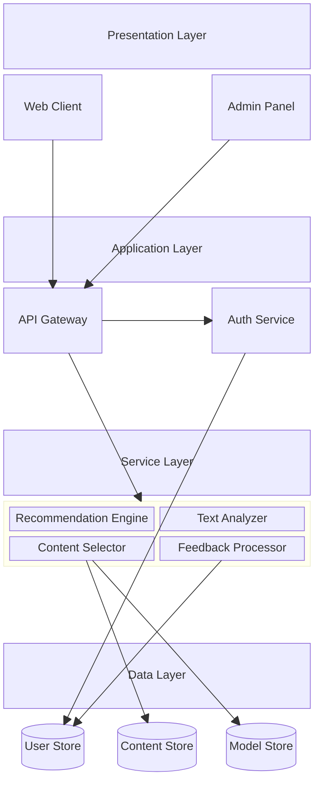

# System Architecture Diagram

## Block Diagram

## Detailed System Description

### 1. Presentation Layer (Frontend)

This is the "Face" of the application. It decouples the user interface from the logic.

- **Web Client (Vue.js/Nuxt)**: The main app for participants. It's designed to be responsive and engaging. It handles:
  - Daily habit logging forms.
  - Displaying music/movie cards with interaction buttons ("Play", "I like this").
  - Real-time feedback collection.
- **Admin Panel**: A restricted dashboard for researchers. It allows them to:
  - Monitor study progress (e.g., "How many users completed logs today?").
  - Export raw CSV data for statistical analysis.

### 2. Application Layer (Backend Entry)

This layer acts as the gatekeeper and traffic controller.

- **API Gateway (FastAPI)**: All client requests hit this first. It ensures:
  - **Routing**: Sends "login" requests to Auth and "recommend" requests to the Engine.
  - **Validation**: Checks that incoming data (like journal text) is formatted correctly.
- **Auth Service**: Handles identity. It generates secure tokens so we know _who_ is making a request without asking them to log in every time.

### 3. Service Layer (The "Brain")

This is where the intelligent decision-making happens.

- **Recommendation Engine**: The conductor. It doesn't generate content itself; it asks the specialized services (Movie/Song recommenders) for options and then decides what to show.
- **Text Analyzer (ML Models)**: Reads the user's journal entry. It uses RoBERTa transformers to "understand" if the user is stressed or happy, converting text into mathematical vectors.
- **Content Selector (Bandit)**: The decision maker. It considers the user's current mood (from Text Analyzer) and history to choose the _single best_ recommendation (Song vs Movie) to show right now.
- **Feedback Processor**: The learner. When a user clicks "This brings back memories," this service updates the models so they get smarter for next time.

### 4. Data Layer (Memory)

Where all persistent information lives.

- **User Store (PostgreSQL)**: Relational data like profiles, logs, and authentication tables.
- **Content Store (PostgreSQL + pgvector)**: A specialized catalog. It stores not just song titles, but "Vector Embeddings" - mathematical representations of how a song _sounds_, allowing us to find similar music mathematically.
- **Model Store**: Filesystem storage for the heavy AI model files (Pickle files, PyTorch weights) that are too large for a standard database.
