# Sequence Diagram

## Recommendation Flow

```mermaid
sequenceDiagram
    autonumber

    actor User
    participant UI as Application
    participant Rec as Recommendation Engine
    participant StressModel as Stress Detection<br/>(RoBERTa)
    participant EmotionModel as Emotion Detection<br/>(DistilRoBERTa)
    participant Bandit as Contextual Bandit<br/>(LinUCB)
    participant Vectors as Content Embeddings
    participant DB as Database

    %% User initiates recommendation
    User->>UI: Request recommendation
    UI->>Rec: Get recommendation for user

    %% Fetch user context
    Rec->>DB: Fetch user preferences
    DB-->>Rec: Birth year, liked movies, liked songs

    Rec->>DB: Fetch latest habit log
    DB-->>Rec: Last stress level, emotion

    %% Real-time text analysis (if journal provided)
    alt Journal text provided
        Rec->>StressModel: Analyze text
        Note over StressModel: RoBERTa fine-tuned<br/>for mental health
        StressModel->>StressModel: Tokenize → Encode → Classify
        StressModel-->>Rec: Stress score (0.0 - 1.0)

        Rec->>EmotionModel: Analyze text
        Note over EmotionModel: DistilRoBERTa 7-class<br/>emotion classifier
        EmotionModel->>EmotionModel: Tokenize → Encode → Classify
        EmotionModel-->>Rec: Emotion label
    end

    %% Generate candidates (10+ years old filter at DB level)
    Rec->>Vectors: Find similar to liked movies
    Note over Vectors: Cosine similarity on<br/>pre-computed embeddings<br/>(10+ years old only)
    Vectors-->>Rec: Movie candidates

    Rec->>Vectors: Find similar to liked songs
    Vectors-->>Rec: Song candidates

    %% Calculate nostalgia score per candidate
    Rec->>Rec: Calculate nostalgia score per candidate
    Note over Rec: personal × (0.7 + 0.3 × popularity)<br/>+ cultural (if pre-birth)

    %% Filter by nostalgia score
    Rec->>Rec: Filter candidates by score

    %% Contextual Bandit selection
    Rec->>Bandit: Select from candidates
    Note over Bandit: Context = [stress, emotion,<br/>positive_rate, birth_year]
    Bandit->>Bandit: Build context vector
    Bandit->>Bandit: Compute UCB score per arm
    Bandit->>Bandit: Select best arm (explore vs exploit)
    Bandit->>Bandit: Stochastic pick from top 5<br/>within selected arm
    Bandit-->>Rec: Selected content

    %% Return recommendation
    Rec-->>UI: Song or Movie
    UI-->>User: Display recommendation
```



## Feedback Loop

```mermaid
sequenceDiagram
    autonumber

    actor User
    participant UI as Application
    participant Rec as Recommendation Engine
    participant Bandit as Contextual Bandit<br/>(LinUCB)
    participant DB as Database

    User->>UI: 👍 or 👎 feedback
    UI->>Rec: Submit feedback

    Rec->>DB: Store interaction
    Note over DB: user_id, content_id,<br/>reward, context

    Rec->>Bandit: Partial fit
    Note over Bandit: reward = 1 (positive)<br/>reward = 0 (negative)
    Bandit->>Bandit: Update A⁻¹ matrix
    Bandit->>Bandit: Update b vector
    Bandit->>Bandit: Recalculate θ

    Bandit-->>Rec: Weights updated
    Rec-->>UI: Confirmation
    UI-->>User: Feedback recorded
```



## Stress & Emotion Detection Pipeline

```mermaid
sequenceDiagram
    autonumber

    participant Text as Journal Entry
    participant Tokenizer as Tokenizer
    participant Model as Transformer
    participant Output as Prediction

    Text->>Tokenizer: "Had a tough day..."

    Note over Tokenizer: BPE tokenization

    Tokenizer->>Tokenizer: Add [CLS] and [SEP]
    Tokenizer->>Tokenizer: Pad/truncate to max_len
    Tokenizer-->>Model: input_ids, attention_mask

    Model->>Model: Token embeddings
    Model->>Model: Transformer layers
    Model->>Model: [CLS] pooling
    Model->>Model: Linear head

    alt Stress Detection
        Model-->>Output: Sigmoid → 0.78
        Note over Output: High stress
    else Emotion Detection
        Model-->>Output: Softmax → "sadness"
        Note over Output: 6 classes:<br/>joy, sadness, anger,<br/>fear, love, surprise
    end
```



## Contextual Bandit Selection Detail

```mermaid
sequenceDiagram
    autonumber

    participant Ctx as Context Builder
    participant Arms as Candidate Arms
    participant UCB as UCB Calculator
    participant Select as Selector

    Ctx->>Ctx: Encode stress (0.0-1.0)
    Ctx->>Ctx: Encode emotion (one-hot)
    Ctx->>Ctx: Encode user positive rate
    Ctx->>Ctx: Encode birth year (normalized)
    Ctx-->>UCB: Context vector x

    Arms-->>UCB: Candidate embeddings

    loop For each candidate arm a
        UCB->>UCB: θₐᵀx (exploitation term)
        UCB->>UCB: α√(xᵀAₐ⁻¹x) (exploration term)
        UCB->>UCB: UCB(a) = θₐᵀx + α√(xᵀAₐ⁻¹x)
    end

    UCB-->>Select: All UCB scores
    Select->>Select: argmax UCB(a)
    Select-->>Arms: Selected arm index
```



## Narrative Explanation

### Recommendation Generation

1. **Fetch User Profile**: Get birth year and liked content (movies + songs from onboarding and positive feedback)

2. **Real-Time Analysis** (optional): If journal text is provided:
   - **Stress Detection**: RoBERTa model outputs 0.0 (calm) to 1.0 (stressed)
   - **Emotion Detection**: DistilBERT classifies into 6 emotions

3. **Candidate Generation**: Find content **similar to what the user liked**:
   - Use cosine similarity on pre-computed embeddings
   - Each recommender returns ~50 similar items

4. **Nostalgia Filtering**:
   - Calculate each candidate's nostalgia zone based on release year vs birth year
   - **High**: Released during childhood (birth → birth+12)
   - **Medium**: Released during teen years (birth+12 → birth+18)
   - **Discovery**: Released after formative years
   - Keep only high/medium nostalgia candidates

5. **Bandit Selection**: LinUCB picks the final content:
   - Context: stress, emotion, user's historical positive rate, birth year
   - Balances exploitation (what worked) vs exploration (try new things)

### Learning from Feedback

1. **Reward Signal**: 👍 = 1, 👎 = 0

2. **Model Update**: LinUCB partial fit updates internal matrices

3. **Future Impact**: Similar users in similar emotional states get better recommendations

---

## Deep Dive: How LinUCB Learns

### The Intuition

Imagine you're a DJ at a party, and you need to pick songs for different moods:

1. **The Problem**: You have 100 songs (arms) and guests arrive in different moods (context). You want to maximize how many people enjoy your picks.

2. **The Dilemma**:
   - **Exploit**: Play songs you _know_ work well → Safe, but you might miss better options
   - **Explore**: Try new songs to learn → Risky, but you discover hidden gems

3. **LinUCB's Solution**: For each song, maintain an **optimistic estimate** of how good it is. If you're uncertain about a song, give it bonus points (encouraging exploration). As you gather data, uncertainty shrinks, and you naturally shift to exploitation.

### What the Context Vector Represents

The context `x` captures "who is this user right now?":

```
x = [stress_level, emotion_joy, emotion_sadness, ..., positive_rate, birth_year_norm]
```

This lets the bandit learn patterns like:

- "When stress is high AND emotion is sadness, nostalgic movies work better than songs"
- "Users born in 1995 respond well to high-nostalgia content when stressed"

### The Three Key Data Structures

For **each arm** (e.g., `movie_high`, `song_medium`), LinUCB maintains:

| Symbol | Intuition                                 | What it stores                            |
| ------ | ----------------------------------------- | ----------------------------------------- |
| **A**  | "How much have I seen this context?"      | Accumulates context patterns (sum of xᵀx) |
| **b**  | "How much reward came from this context?" | Accumulates reward × context (sum of r·x) |
| **θ**  | "My best guess for this arm's quality"    | Computed from A and b                     |

### The Math (Step by Step)

#### 1. Prediction: "Which arm should I pick?"

For each arm, compute the **Upper Confidence Bound**:

```
UCB(arm) = θᵀx + α·√(xᵀA⁻¹x)
           ────────   ──────────────
           Expected   Exploration
           Reward     Bonus
```

- **θᵀx**: "Based on past data, how good is this arm for context x?"
- **α·√(xᵀA⁻¹x)**: "How uncertain am I?" (larger when we've seen less data)

Pick the arm with highest UCB.

#### 2. Update: "Learn from what just happened"

After showing content and getting feedback (reward = 0 or 1):

```
A_new = A_old + xᵀx        ← "I've now seen this context one more time"
b_new = b_old + reward·x   ← "Add the reward signal for this context"
θ_new = A⁻¹_new · b_new    ← "Recalculate my estimate"
```

This is **partial fit** (online learning) - we update with one observation at a time, no need to retrain on all historical data.

#### 3. Why This Works

- When **A grows** (more observations), **A⁻¹ shrinks** → uncertainty decreases
- When **uncertainty is low**, exploration bonus is small → we exploit
- When **uncertainty is high**, exploration bonus is large → we explore
- Over time, we converge to the optimal arm for each context

### Concrete Example

**Scenario**: User is stressed (0.8) and sad. Two arms available:

| Arm        | θᵀx (expected) | √(xᵀA⁻¹x) (uncertainty) | UCB (α=1) |
| ---------- | -------------- | ----------------------- | --------- |
| movie_high | 0.7            | 0.1 (seen 50 times)     | 0.8       |
| song_high  | 0.5            | 0.4 (seen 5 times)      | **0.9**   |

Even though movies have higher expected reward, we pick the song because we're uncertain about it. If the song gets 👍, we learn songs might actually be better for sad+stressed users.

### The Hierarchical Layer

Your implementation uses a **hierarchical bandit**:

1. **Global Model**: Learns patterns across ALL users
2. **Per-User Model**: Fine-tunes for individual preferences

This means:

- New users benefit from global learning ("most stressed users like X")
- Returning users get personalized recommendations
