# Class Diagram

This section presents the core domain model of the Nostalgic Persuasive Recommendation System. The class diagram illustrates the primary services and entities that enable personalized nostalgic content delivery for behavior change interventions.

## Core Domain Model

```mermaid
classDiagram
    direction TB

    %% ─────────────────────────────────────────────────────────────────────────
    %% RECOMMENDATION SERVICES
    %% ─────────────────────────────────────────────────────────────────────────

    class MovieRecommender {
        -model: LightFM
        -database_url: str
        +recommend(liked_items, n) list~Movie~
        +get_movie_info(movie_id) Movie
        +search_movies(query, limit) list~Movie~
    }

    class SongRecommender {
        -feature_transformers: dict
        -database_url: str
        +recommend(liked_items, n) list~Song~
        +get_song_info(spotify_id) Song
        +search_songs(query, limit) list~Song~
    }

    %% ─────────────────────────────────────────────────────────────────────────
    %% TEXT ANALYSIS SERVICES
    %% ─────────────────────────────────────────────────────────────────────────

    class StressDetector {
        -model: RoBERTa
        -tokenizer: AutoTokenizer
        +predict(text) float
        +close()
    }

    class EmotionDetector {
        -model: DistilRoBERTa
        -tokenizer: AutoTokenizer
        +LABELS: list~str~
        +predict(text) EmotionResult
        +close()
    }

    %% ─────────────────────────────────────────────────────────────────────────
    %% CONTEXTUAL BANDIT
    %% ─────────────────────────────────────────────────────────────────────────

    class LinUCBBandit {
        -arms: list~str~
        -alpha: float
        -mab: MABWiser
        +select(context, candidates) tuple
        +update(context, candidate, reward)
        +save(filepath)
        +load(filepath)
    }

    class HierarchicalBandit {
        -global_model: LinUCBBandit
        -user_models: dict
        -models_dir: Path
        +select(user_id, context, candidates) tuple
        +update(user_id, context, candidate, reward)
        +close()
    }

    %% ─────────────────────────────────────────────────────────────────────────
    %% DOMAIN ENTITIES
    %% ─────────────────────────────────────────────────────────────────────────

    class User {
        +id: string
        +name: string
        +email: string
    }

    class UserPreferences {
        +userId: string
        +birthYear: int
        +habitType: HabitType
        +experimentGroup: ExperimentGroup
        +selectedMovieIds: list~int~
        +selectedSongIds: list~str~
    }

    class DailyHabitLog {
        +id: string
        +userId: string
        +date: Date
        +completed: boolean
        +notes: string
        +stressLevel: float
        +emotion: string
    }

    class ContentFeedback {
        +id: string
        +userId: string
        +contentType: ContentType
        +contentId: string
        +bringsBackMemories: boolean
    }

    class Movie {
        +movieId: int
        +title: string
        +genres: string
        +year: int
        +decade: string
    }

    class Song {
        +spotifyId: string
        +name: string
        +artists: string
        +genre: string
        +year: int
    }

    %% ─────────────────────────────────────────────────────────────────────────
    %% RELATIONSHIPS
    %% ─────────────────────────────────────────────────────────────────────────

    %% Bandit composition
    HierarchicalBandit o-- LinUCBBandit : manages

    %% User relationships
    User "1" -- "1" UserPreferences : has
    User "1" -- "*" DailyHabitLog : logs
    User "1" -- "*" ContentFeedback : provides

    %% Recommender outputs
    MovieRecommender ..> Movie : recommends
    SongRecommender ..> Song : recommends

    %% Bandit selects content
    HierarchicalBandit ..> Movie : selects
    HierarchicalBandit ..> Song : selects

    %% Text analyzer processes logs
    StressDetector ..> DailyHabitLog : analyzes
    EmotionDetector ..> DailyHabitLog : analyzes

    %% Feedback references content
    ContentFeedback --> Movie : references
    ContentFeedback --> Song : references
```

## Component Descriptions

The system architecture comprises four distinct component categories: **Recommendation Services**, **Text Analysis Services**, **Contextual Bandit System**, and **Domain Entities**. Each component plays a specific role in delivering personalized nostalgic content to support behavior change.

### Recommendation Services

The recommendation layer generates candidate content items using two complementary approaches tailored to each media type:

**MovieRecommender** employs hybrid recommendation through the LightFM library, which combines collaborative filtering with content-based features. The hybrid approach uses matrix factorization to learn latent user and item embeddings from interaction data (MovieLens ratings), while simultaneously incorporating item features (genres, metadata) to enhance predictions. This combination addresses the cold-start problem more effectively than pure collaborative filtering. For new participants who are not in the original training dataset, the recommender uses _user folding_—a technique that projects new users into the existing latent space by computing a weighted average of item embeddings from their liked movies (with recency weighting to prioritize recent preferences).

**SongRecommender** utilizes content-based filtering through vector similarity search. Each song is represented as a 128-dimensional embedding derived from Spotify audio features (danceability, energy, valence, tempo, etc.). These embeddings are stored in PostgreSQL using the pgvector extension, enabling efficient approximate nearest-neighbor queries. When generating recommendations, the system computes a weighted centroid of the user's liked songs (with recency weighting) and retrieves similar tracks via cosine similarity.

Both recommenders enforce a **nostalgia filter** that excludes content released within the past 10 years, ensuring all recommendations evoke potential nostalgic associations from the user's formative years.

### Text Analysis Services

The text analysis layer extracts psychological signals from user-generated journal entries, providing contextual features for the recommendation pipeline:

**StressDetector** utilizes a fine-tuned RoBERTa transformer model trained on the Dreaddit dataset for stress detection in social media text. The model outputs a continuous stress score between 0 (no stress) and 1 (high stress), which serves as a key contextual feature for the bandit's decision-making process. High-stress contexts may benefit from different content selection strategies.

**EmotionDetector** employs a fine-tuned DistilRoBERTa model trained on the Super-Emotion dataset for multi-label emotion classification. The model predicts probabilities across seven emotion categories: _anger_, _fear_, _joy_, _love_, _neutral_, _sadness_, and _surprise_. The dominant emotion (highest probability exceeding a calibrated threshold) is extracted and stored alongside the user's daily log, enabling emotion-aware content personalization.

Both models run inference on-device using PyTorch, with GPU acceleration when available, and implement proper resource cleanup through explicit `close()` methods.

### Contextual Bandit System

The contextual bandit system optimizes content selection through online learning, balancing exploration of new content against exploitation of known preferences:

**LinUCBBandit** implements the Linear Upper Confidence Bound algorithm for contextual bandits using the MABWiser library. Each arm (content genre) maintains a ridge regression model that predicts expected reward given a context vector. The context vector encodes the user's current state: stress level, emotion probabilities, historical positive feedback rate, and birth year (for nostalgia calibration). The algorithm selects arms by computing upper confidence bounds that account for both expected reward and estimation uncertainty, naturally encouraging exploration of under-sampled arms.

**HierarchicalBandit** implements a two-tier personalization strategy:

1. **Global Model**: A shared LinUCB model trained on all user interactions, providing reasonable cold-start predictions for new users
2. **Per-User Models**: Individual LinUCB models that adapt to each user's specific preferences over time

The hierarchical approach uses the global model exclusively until a user accumulates sufficient interactions (configurable threshold), then progressively shifts weight toward the personalized model. All models persist to disk using joblib serialization, enabling warm restarts across system reboots.

### Domain Entities

The domain model captures the essential data structures for the research study:

**User** represents a study participant with standard authentication fields. Users are assigned to either the treatment group (receiving nostalgic recommendations) or control group (receiving standard recommendations) for experimental comparison.

**UserPreferences** stores participant metadata collected during onboarding, including birth year (used to calibrate nostalgia windows), habit type (exercise or smoking cessation), experiment group assignment, and initial content preferences. The selected movie and song IDs from onboarding serve as seed data for the recommendation algorithms.

**DailyHabitLog** captures daily progress entries including habit completion status, optional journal notes, and the computed stress level and emotion from text analysis. This entity forms the primary data source for measuring intervention effectiveness and provides the context features for bandit optimization.

**ContentFeedback** records user responses to the "Does this bring back memories?" prompt displayed after content consumption. The boolean response serves as the reward signal for bandit learning—positive responses indicate successful nostalgia induction and reinforce the selected content type/genre.

**Movie** and **Song** represent catalog items from the MovieLens and Spotify datasets respectively, storing metadata necessary for display and recommendation filtering.

## Key Relationships

The class diagram illustrates several important relationships:

- **Composition**: `HierarchicalBandit` manages multiple `LinUCBBandit` instances (one global, many per-user)
- **One-to-One**: Each `User` has exactly one `UserPreferences` record
- **One-to-Many**: Users generate multiple `DailyHabitLog` and `ContentFeedback` records over time
- **Dependencies**: Recommenders produce content candidates; the bandit selects from these candidates; text analyzers provide context features from habit logs; feedback closes the learning loop
