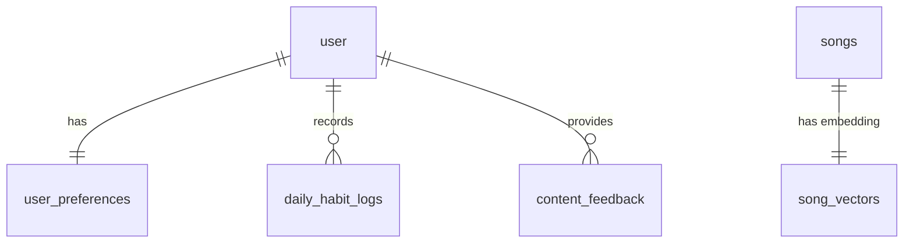

# Database Entity Relationship Diagram (ERD)

This diagram illustrates the database structure for the Nostalgic Persuasive Recommendation System—a research application that delivers personalized nostalgic content (songs and movies) to support behavior change interventions.

## Entity Relationship Diagram

## Explanation

The database consists of **seven tables** organized around two core functions: tracking participant behavior and storing content for recommendations.

### User-Centric Tables

**user** is the central table that anchors all participant data. When a participant registers, a user record is created containing their identity information (name, email).

**user_preferences** stores each participant's research settings in a one-to-one relationship with user. This includes their `birth_year` (used to calculate which content falls within their nostalgic "reminiscence bump" period of ages 10-22), their `experiment_group` assignment (treatment receives nostalgic recommendations, control receives standard recommendations), and their `habit_type` (exercise or smoking cessation). The `selected_movie_ids` and `selected_song_ids` fields store the content they chose during onboarding, which seeds the recommendation algorithms.

**daily_habit_logs** captures daily check-ins from participants. Each record includes whether they `completed` their habit that day and optional `notes` (journal entries). The `stress_level` and `emotion` fields are automatically populated by NLP models that analyze the journal text—these values become context features for the recommendation system.

**content_feedback** records participant responses to the question "Does this bring back memories?" after viewing a recommendation. The `brings_back_memories` boolean serves as the reward signal for the contextual bandit algorithm. The `content_type` field indicates whether the feedback is for a song or movie, and `content_id` stores the corresponding ID.

### Content Catalog Tables

**songs** contains ~100,000 tracks from Spotify with audio features (danceability, energy, valence, tempo, etc.) and metadata. The `year` field enables filtering for nostalgic content (10+ years old).

**song_vectors** stores 128-dimensional embeddings for each song, enabling similarity-based recommendations via PostgreSQL's pgvector extension. Each song has exactly one corresponding vector.

**movies** contains ~100,000 titles from the MovieLens dataset with genre information and aggregate ratings. Like songs, the `year` field enables nostalgia filtering.

### Key Relationships

| Relationship            | Type        | Purpose                                                   |
| ----------------------- | ----------- | --------------------------------------------------------- |
| user → user_preferences | One-to-One  | Each participant has one preferences record               |
| user → daily_habit_logs | One-to-Many | Participants log daily over the study period              |
| user → content_feedback | One-to-Many | Participants provide feedback on multiple recommendations |
| songs → song_vectors    | One-to-One  | Each song has one embedding for similarity search         |

> [!NOTE]
> The `content_feedback` table uses a polymorphic pattern—`content_id` can reference either `songs.id` or `movies.id` depending on `content_type`. This avoids needing separate feedback tables for each content type.
