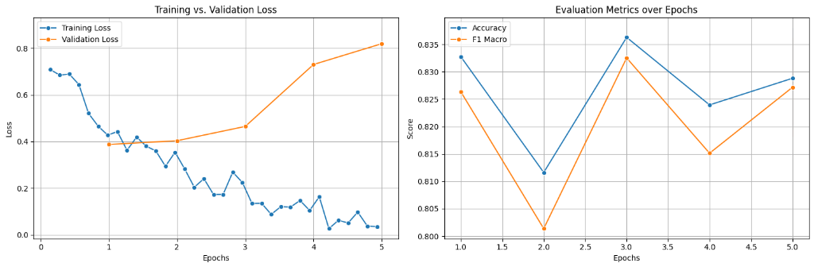
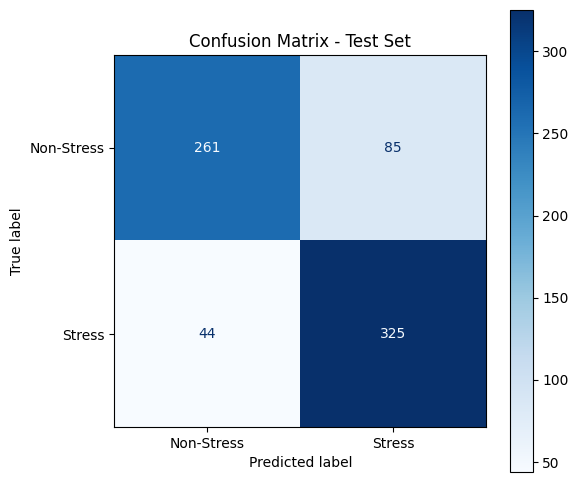

# Stress Detection Model: Evaluation Metrics and Performance Analysis

## 1. Introduction

This document presents a comprehensive analysis of the evaluation metrics and performance of a text-based stress detection model. The model employs transfer learning techniques, fine-tuning a pre-trained transformer architecture on the Dreaddit dataset to classify textual content as indicative of stress or non-stress.

## 2. Model Architecture

### 2.1 Base Model Selection

The stress detection system utilizes **Mental-RoBERTa-Base** (`mental/mental-roberta-base`) as its foundation. This model is a domain-specific variant of RoBERTa that has been pre-trained on mental health-related text data, making it particularly well-suited for stress detection tasks.

The choice of Mental-RoBERTa-Base offers several advantages:

- **Domain Specificity**: Pre-training on mental health corpora provides the model with contextual understanding of psychological and emotional language patterns
- **Transfer Learning Efficiency**: The domain-aligned pre-training reduces the semantic gap between pre-training and fine-tuning objectives
- **Robust Representations**: RoBERTa's training methodology (dynamic masking, larger mini-batches, longer training) yields more stable text representations

### 2.2 Classification Head

A sequence classification head was added to the base model for binary classification (stress vs. non-stress), with the classifier layers randomly initialized and trained during fine-tuning.

## 3. Dataset: Dreaddit

### 3.1 Dataset Overview

The model was trained and evaluated on the **Dreaddit** dataset (`asmaab/dreaddit`), a benchmark corpus specifically designed for stress detection in social media text.

| Split      | Sample Count |
| ---------- | ------------ |
| Training   | 2,270        |
| Validation | 568          |
| Test       | 715          |
| **Total**  | **3,553**    |

### 3.2 Dataset Characteristics

The Dreaddit dataset comprises posts from Reddit across various subreddits, with binary labels indicating the presence or absence of stress. The dataset captures diverse expressions of stress in naturalistic online discourse, encompassing:

- Financial stress
- Relationship difficulties
- Work-related anxiety
- Academic pressure
- Health concerns

## 4. Training Configuration

### 4.1 Hyperparameters

The model was fine-tuned with the following configuration:

| Parameter               | Value              |
| ----------------------- | ------------------ |
| Number of Epochs        | 5                  |
| Batch Size (Train)      | 32                 |
| Batch Size (Eval)       | 32                 |
| Warmup Steps            | 100                |
| Weight Decay            | 0.1                |
| Learning Rate Schedule  | Linear with warmup |
| Max Sequence Length     | 512                |
| Mixed Precision         | FP16 (GPU)         |
| Evaluation Strategy     | Per epoch          |
| Early Stopping Patience | 2 epochs           |
| Metric for Best Model   | F1 Macro           |

### 4.2 Training Dynamics

The model demonstrated consistent learning progression across training epochs, with early stopping implemented to prevent overfitting.

## 5. Evaluation Metrics

### 5.1 Metrics Employed

The following evaluation metrics were computed to assess model performance:

1. **Accuracy**: The proportion of correctly classified instances
2. **F1 Score (Macro)**: Unweighted mean of class-wise F1 scores, treating both classes equally regardless of class imbalance
3. **F1 Score (Weighted)**: Weighted average of class-wise F1 scores, accounting for class distribution
4. **Precision (Macro)**: Average precision across both classes
5. **Recall (Macro)**: Average recall across both classes

### 5.2 Metric Definitions

#### Per-Class Metrics

For each class $c$, we define:

**Precision** measures the proportion of positive predictions that are correct:
$$\text{Precision}_c = \frac{TP_c}{TP_c + FP_c}$$

**Recall** (Sensitivity) measures the proportion of actual positives correctly identified:
$$\text{Recall}_c = \frac{TP_c}{TP_c + FN_c}$$

**F1 Score** is the harmonic mean of precision and recall:
$$F1_c = 2 \cdot \frac{\text{Precision}_c \cdot \text{Recall}_c}{\text{Precision}_c + \text{Recall}_c}$$

#### Aggregated Metrics

**F1 Macro** computes the F1 score for each class independently, then takes the unweighted average. Each class contributes equally regardless of sample count:
$$F1_{\text{macro}} = \frac{1}{n} \sum_{c=1}^{n} F1_c = \frac{F1_{\text{Non-Stress}} + F1_{\text{Stress}}}{2}$$

**F1 Weighted** computes F1 for each class, then takes a weighted average based on the number of samples (support) in each class:
$$F1_{\text{weighted}} = \frac{\sum_{c=1}^{n} (F1_c \times \text{support}_c)}{\sum_{c=1}^{n} \text{support}_c}$$

**Precision Macro** and **Recall Macro** similarly average per-class metrics equally:
$$\text{Precision}_{\text{macro}} = \frac{\text{Precision}_{\text{Non-Stress}} + \text{Precision}_{\text{Stress}}}{2}$$
$$\text{Recall}_{\text{macro}} = \frac{\text{Recall}_{\text{Non-Stress}} + \text{Recall}_{\text{Stress}}}{2}$$

#### When to Use Each

| Metric                 | Use Case                                                              |
| ---------------------- | --------------------------------------------------------------------- |
| **Macro averaging**    | When all classes are equally important, regardless of their frequency |
| **Weighted averaging** | When you want class frequency to influence overall performance score  |
| **Per-class metrics**  | When analyzing performance on a specific class of interest            |

## 6. Results

### 6.1 Training Progress by Epoch

| Epoch | Training Loss | Validation Loss | Accuracy | F1 Macro | F1 Weighted | Precision Macro | Recall Macro |
| ----- | ------------- | --------------- | -------- | -------- | ----------- | --------------- | ------------ |
| 1     | 0.4273        | 0.3874          | 0.8327   | 0.8264   | 0.8294      | 0.8492          | 0.8221       |
| 2     | 0.3542        | 0.4034          | 0.8116   | 0.8014   | 0.8055      | 0.8397          | 0.7975       |
| 3     | 0.2246        | 0.4648          | 0.8363   | 0.8325   | 0.8348      | 0.8415          | 0.8295       |
| 4     | 0.1043        | 0.7304          | 0.8239   | 0.8151   | 0.8188      | 0.8498          | 0.8108       |
| 5     | 0.0349        | 0.7512          | 0.8380   | 0.8362   | 0.8378      | 0.8374          | 0.8354       |

The increasing validation loss across epochs while training loss decreases indicates the model began overfitting after the first epoch. The early stopping mechanism with patience of 2 allowed exploration of the loss landscape while ultimately selecting the best-performing checkpoint based on F1 Macro score.

_Figure 1: Training vs. Validation Loss (left) and Accuracy/F1 Macro metrics over epochs (right)_

The left panel of Figure 1 illustrates the divergence between training and validation loss, a classic indicator of overfitting. The training loss decreases steadily from approximately 0.7 to near 0, while validation loss initially decreases but begins increasing after epoch 1. The right panel shows the evaluation metrics (Accuracy and F1 Macro) fluctuating across epochs, with best performance achieved at epochs 1 and 5.

### 6.2 Final Test Set Performance

| Metric              | Value  |
| ------------------- | ------ |
| **Accuracy**        | 81.96% |
| **F1 Macro**        | 81.81% |
| **F1 Weighted**     | 81.86% |
| **Precision Macro** | 82.42% |
| **Recall Macro**    | 81.75% |
| Test Loss           | 0.8881 |

### 6.3 Analysis

The test set results demonstrate robust generalization capabilities:

1. **Balanced Performance**: The close alignment between macro and weighted F1 scores (81.81% vs 81.86%) indicates consistent performance across both stress and non-stress classes
2.
3. **Precision-Recall Balance**: The macro precision (82.42%) and macro recall (81.75%) are well-balanced, suggesting the model neither systematically over-predicts nor under-predicts stress instances
4. **Generalization Gap**: The difference between training accuracy (~99% by epoch 5) and test accuracy (81.96%) indicates some overfitting, though the final test performance remains strong
5. **Clinical Applicability**: The high precision score is particularly valuable in stress detection contexts, as it minimizes false positives that could lead to unnecessary interventions

## 7. Confusion Matrix Analysis

The confusion matrix provides a detailed breakdown of model predictions across both classes, revealing the distribution of true positives, true negatives, false positives, and false negatives.

### 7.1 Validation Set Confusion Matrix

_Figure 2: Confusion Matrix for the Validation Set_

The validation set confusion matrix reveals the following classification distribution:

|                       | Predicted Non-Stress | Predicted Stress |
| --------------------- | -------------------- | ---------------- |
| **Actual Non-Stress** | 208 (TN)             | 50 (FP)          |
| **Actual Stress**     | 42 (FN)              | 268 (TP)         |

From this matrix, we can derive:

- **True Negative Rate (Specificity)**: 208 / (208 + 50) = 80.62%
- **True Positive Rate (Sensitivity/Recall)**: 268 / (268 + 42) = 86.45%
- **Positive Predictive Value (Precision)**: 268 / (268 + 50) = 84.28%
- **Negative Predictive Value**: 208 / (208 + 42) = 83.20%

The model demonstrates higher sensitivity (86.45%) than specificity (80.62%), indicating a slight tendency to identify stress cases more reliably than non-stress cases.

### 7.2 Test Set Confusion Matrix

_Figure 3: Confusion Matrix for the Test Set_

The test set confusion matrix shows:

|                       | Predicted Non-Stress | Predicted Stress |
| --------------------- | -------------------- | ---------------- |
| **Actual Non-Stress** | 261 (TN)             | 85 (FP)          |
| **Actual Stress**     | 44 (FN)              | 325 (TP)         |

From this matrix:

- **True Negative Rate (Specificity)**: 261 / (261 + 85) = 75.43%
- **True Positive Rate (Sensitivity/Recall)**: 325 / (325 + 44) = 88.08%
- **Positive Predictive Value (Precision)**: 325 / (325 + 85) = 79.27%
- **Negative Predictive Value**: 261 / (261 + 44) = 85.57%

### 7.3 Comparative Analysis

Comparing validation and test set performance:

| Metric               | Validation | Test   |
| -------------------- | ---------- | ------ |
| Specificity          | 80.62%     | 75.43% |
| Sensitivity (Recall) | 86.45%     | 88.08% |
| Precision            | 84.28%     | 79.27% |
| NPV                  | 83.20%     | 85.57% |

Key observations:

1. **Higher Sensitivity on Test Set**: The model correctly identifies 88.08% of stress cases in the test set, compared to 86.45% on validation
2. **Lower Specificity on Test Set**: Non-stress classification accuracy dropped from 80.62% to 75.43%
3. **Error Distribution**: The model shows a preference for classifying instances as "Stress," resulting in more false positives (85) than false negatives (44) on the test set

This pattern suggests the model prioritizes recall over precision, which may be appropriate for a stress detection system where missing a stressed individual (false negative) could be more consequential than a false alarm (false positive).

## 8. Discussion

### 8.1 Strengths

- **Domain-Specific Pre-training**: The use of Mental-RoBERTa provides contextual understanding specific to mental health discourse
- **Balanced Metrics**: Near-equal precision and recall suggest unbiased class predictions
- **Consistent Performance**: Similar performance across validation and test sets indicates reliable generalization

### 8.2 Limitations

- **Dataset Scope**: The Dreaddit dataset, while valuable, represents stress expression patterns specific to Reddit's user base
- **Binary Classification**: The model distinguishes only presence/absence of stress, not stress severity or type
- **Temporal Aspects**: The model processes individual text segments without considering longitudinal patterns

### 8.3 Future Directions

1. **Multi-class Classification**: Extending the model to categorize stress types (work, financial, relationship, etc.)
2. **Severity Estimation**: Incorporating regression objectives for stress intensity prediction
3. **Cross-Platform Evaluation**: Assessing generalization to other social media platforms

## 9. Conclusion

The stress detection model achieves strong performance with 81.96% accuracy and 81.81% F1 Macro score on the held-out test set. The balanced precision (82.42%) and recall (81.75%) metrics demonstrate the model's capability to reliably identify stressed individuals from text without systematic bias toward either class. These results validate the effectiveness of domain-specific pre-training combined with careful fine-tuning for mental health text classification tasks.
